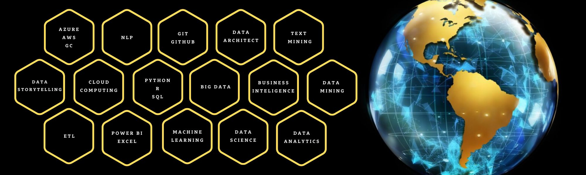

<!--
**AnaRamos2022/AnaRamos2022** is a ✨ _special_ ✨ repository because its `README.md` (this file) appears on your GitHub profile.

Here are some ideas to get you started:

- 🔭 I’m currently working on ...
- 🌱 I’m currently learning ...
- 👯 I’m looking to collaborate on ...
- 🤔 I’m looking for help with ...
- 💬 Ask me about ...
- 📫 How to reach me: ...
- 😄 Pronouns: ...
- ⚡ Fun fact: ...
-->

  

  

<h2 align="center">Here you can find some of my skills: </h2>

### 🔭 I’m currently working on a data analytics project involving **web scraping, databases, ETL, and visualization with Power BI**.  
### 🌱 I’m currently learning advanced data science techniques, including **machine learning and cloud computing (Azure)**.  
### 👯 I’m looking to collaborate on data-driven projects related to **business intelligence, predictive analytics, and data visualization**.  
